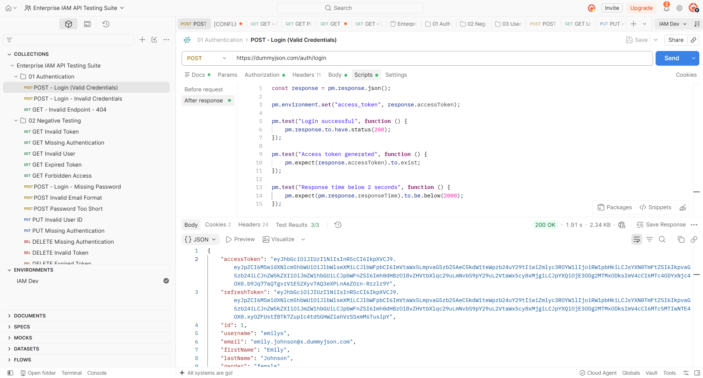
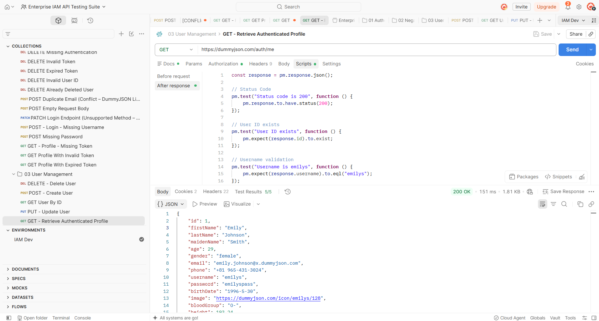

# Enterprise IAM API Testing Suite


> End-to-End API Testing Project built with **Postman** for an Enterprise Identity and Access Management (IAM) system.

## Project Overview

This project demonstrates automated REST API testing using Postman and the DummyJSON API. It covers authentication, authorization, CRUD operations, user profile APIs, and negative testing scenarios using JavaScript assertions and Collection Runner.

---

## Highlights

- 31 API requests covering Authentication, User Management, and Negative Testing.
- 126 automated test assertions written using Postman JavaScript.
- Bearer Token authentication with environment variables.
- CRUD API validation using DummyJSON endpoints.
- Collection Runner execution with 100% passing tests.
- Response validation, schema checks, and response-time assertions.
- HTTP status validation (200, 201, 400, 401, 403, 404).

---

## API Modules

| Module           | Requests |
| ---------------- | -------: |
| Authentication   |        2 |
| Negative Testing |       25 |
| User Management  |        4 |
| **Total**        |   **31** |

---

## Automated Test Coverage

* **126 Automated Assertions**
* **126 Passed**
* **0 Failed**
* **0 Errors**

Average response time during Collection Runner execution: **549 ms**.

---

## Tech Stack

| Tool | Purpose |
|------|---------|
| Postman | API testing & automation |
| JavaScript | Test scripts and assertions |
| DummyJSON API | Mock REST API |
| GitHub | Version control & portfolio |

---

## Environment Variables

| Variable       | Purpose                            |
| -------------- | ---------------------------------- |
| `base_url`     | DummyJSON API Base URL             |
| `access_token` | Bearer Token generated after login |

---

## Repository Structure

```text
Enterprise-IAM-API-Testing-Suite
│
├── collections/
│   └── Enterprise IAM API Testing Suite.postman_collection.json
│
├── environments/
│   └── IAM Dev.postman_environment.json
│
├── screenshots/
│   ├── Collection Overview.png
│   ├── Environment Variables.png
│   ├── GET My Profile Success.png
│   ├── POST Login Success Tests.png
│   └── Collection Runner — 126 Passed.png
│
├── README.md
└── LICENSE
```

---

## Project Screenshots

### Collection Structure


### Environment Variables


### Login API Test (200 OK)



### Authenticated Profile API (200 OK)



### Collection Runner Results


---

## Skills Demonstrated

* REST API Testing
* API Automation
* Authentication Testing
* Authorization Testing
* CRUD API Testing
* Negative Testing
* Postman Collection Runner
* JavaScript Assertions
* Environment Variable Management
* Response Validation
* Performance Validation (Response Time)

---

## How to Run

1. Import the Postman Collection from `collections/`.
2. Import the IAM Dev Environment from `environments/`.
3. Select the **IAM Dev** environment.
4. Run the Login request to generate an access token.
5. Execute the Collection Runner.

---

## Project Result

Successfully built and executed an Enterprise IAM API Testing Suite with **31 API requests** and **126 automated assertions**, achieving **100% test pass rate**.
