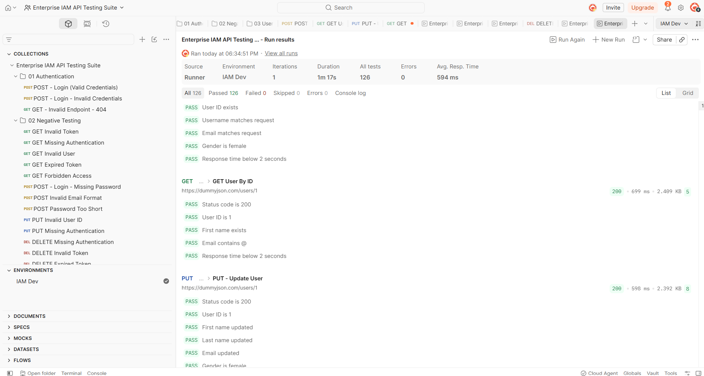
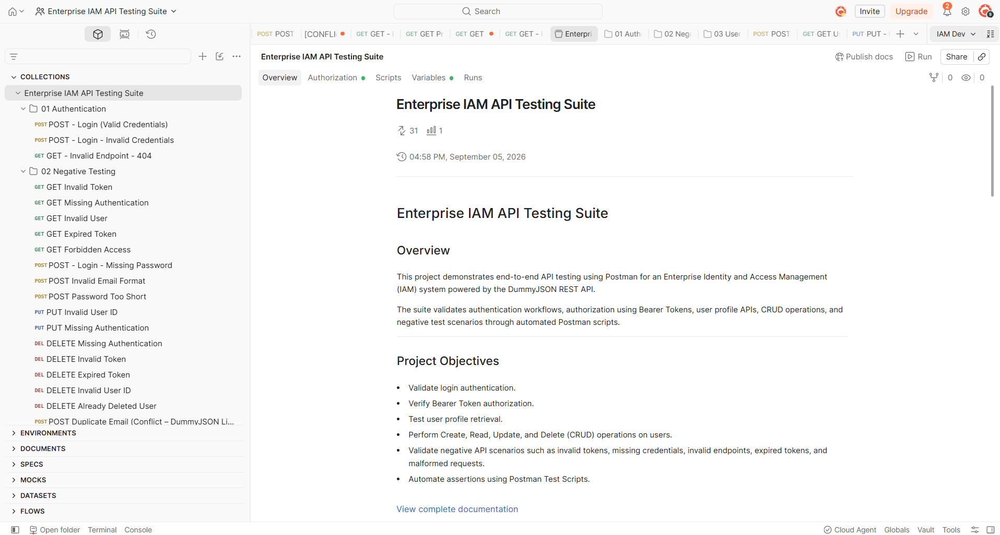
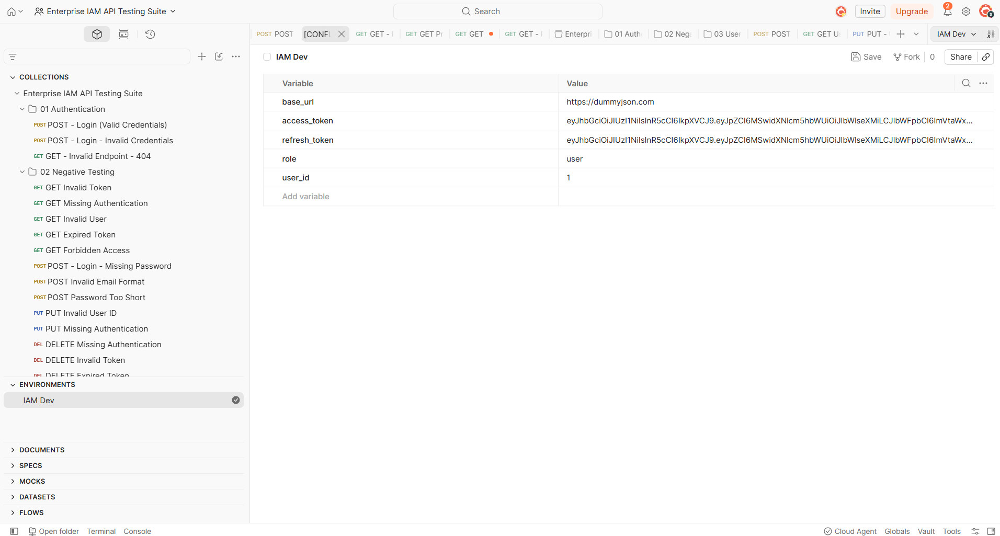

# Enterprise IAM API Testing Suite

> End-to-End API Testing Project built with **Postman** for an Enterprise Identity and Access Management (IAM) system.

## Project Overview

This project demonstrates automated REST API testing using Postman and the DummyJSON API. It covers authentication, authorization, CRUD operations, user profile APIs, and negative testing scenarios using JavaScript assertions and Collection Runner.

---

## Project Features

* Authentication Testing
* Bearer Token Authorization
* User Management CRUD APIs
* Negative API Testing
* Automated Test Scripts
* Environment Variables
* Collection Runner Automation
* Response Time Validation

---

## API Modules

| Module           | Requests |
| ---------------- | -------: |
| Authentication   |        2 |
| Negative Testing |       25 |
| User Management  |        4 |
| **Total**        |   **31** |

---

## Automated Test Coverage

* **126 Automated Assertions**
* **126 Passed**
* **0 Failed**
* **0 Errors**

Average response time during Collection Runner execution: **549 ms**.

---

## Technologies Used

* Postman
* JavaScript (Postman Test Scripts)
* REST APIs
* DummyJSON API
* Collection Runner
* Environment Variables

---

## Environment Variables

| Variable       | Purpose                            |
| -------------- | ---------------------------------- |
| `base_url`     | DummyJSON API Base URL             |
| `access_token` | Bearer Token generated after login |

---

## Folder Structure

```text
collections/
environments/
screenshots/
README.md
LICENSE
```

---

## Project Screenshots

### Collection Runner — All Tests Passed



### Collection Overview



### Authentication — Login Success


### Environment Variables



### User Profile API Success


---

## Skills Demonstrated

* REST API Testing
* API Automation
* Authentication Testing
* Authorization Testing
* CRUD API Testing
* Negative Testing
* Postman Collection Runner
* JavaScript Assertions
* Environment Variable Management
* Response Validation
* Performance Validation (Response Time)

---

## How to Run

1. Import the Postman Collection from `collections/`.
2. Import the IAM Dev Environment from `environments/`.
3. Select the **IAM Dev** environment.
4. Run the Login request to generate an access token.
5. Execute the Collection Runner.

---

## Project Result

Successfully built and executed an Enterprise IAM API Testing Suite with **31 API requests** and **126 automated assertions**, achieving **100% test pass rate**.
